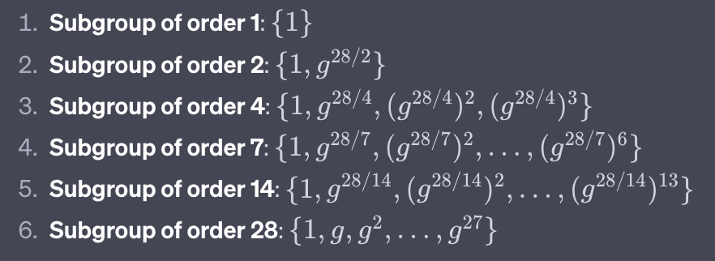
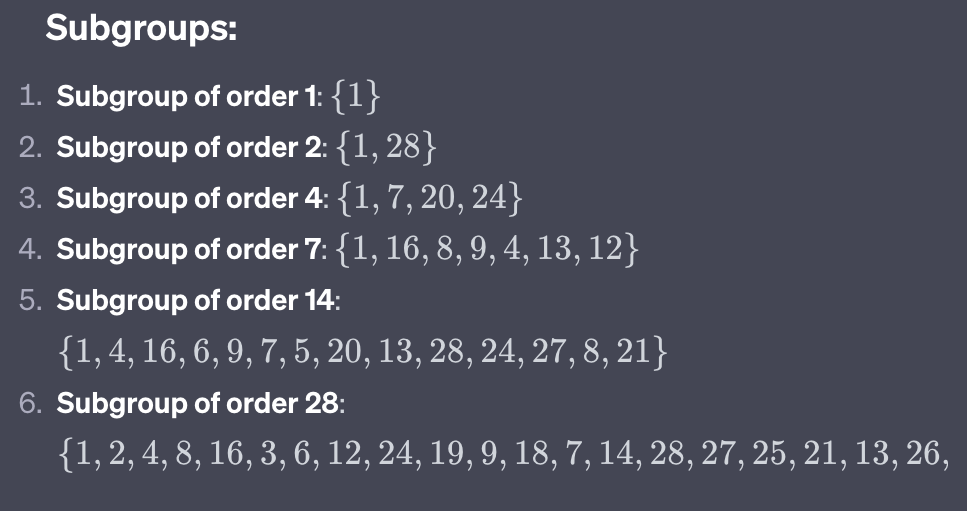

# Subgroups and attack

## Description

1. p = 29
2. Find n, which is Euler's phi function or totient function, which is, p - 1 or (p-1)(q-1), Hence n here is 28
3. Find divisors of 28
4. The Optimized trial division is sufficient for small numbers. For larger numbers or when dealing with a range of numbers, algorithms like the Sieve of Eratosthenes or Pollard's rho are more efficient.
5. Optimized trial division algorithm
   1. The square root of 28 is approximately 5.29. So, we'll check numbers from 1 to 5.
   2. Check each number:
      - 11 divides 28: Add 1 and 28 to the list.
      - 22 divides 28: Add 2 and 14 to the list.
      - 33 does not divide 28.
      - 44 divides 28: Add 4 and 7 to the list.
      - 55 does not divide 28.
   3. The divisors of 28 are: 1, 28, 2, 14, 4, and 7.
6. Find generator points for p = 29.
   1. Find Φ, which is 28
   2. Find prime factor of Φ(29), i.e., 28. These are the numbers we will use to check if a number is a primitive root.
      - Prime factors of 28 are 2 and 7, which can be calculated using Pollard's Rho Algorithm
   3. Finding and Testing potential primitive roots:
      - For each integer g from 2 to 28, compute g^(28/q) mod 29 for each prime factor q of 28.
      - If any of these result is 1, then g is not a primitive root.
      - If none of them are 1, then g is a primitive root.
      - We can start with integer 2, and compute:
        - 2^(28/2) mod 29
        - 2^(28/7) mod 29
      - If neither of these results is 1, then 2 is a primitive root of modulo 29.
      - This can be computed manually as well which confirms that there are no repeating elements.
   4. All the generators(primitive roots) are 2,3,8,10,11,14,15,18,19,21,26,27,28
7. Compute all the subgroups of all orders
   1. we will use g=2 as a generator for the full group(primitive root modulo 29)
   2. For each divisor d, we'll compute g^(n/d) mod p to get a generator for the subgroup of order d(divisors of 28).
   3. To compute the subgroups of all orders, we'll raise the generator of each subgroup to all powers less than the order of that subgroup:
      
   4. After computing these results, subgroups for p=29 are
      
   5. Let's take subgroup of order 4: {1,7,20,24}
      - starting with operation with 7 such that:
        - 7^0 mod 29 = 1
        - 7^1 mod 29 = 7
        - 7^2 mod 29 = 20
        - 7^3 mod 29 = 24
      - Hence 7 is a generator for subgroup of order 7.
8. Attack using subgroups
    - Aryan and Neha are using Diffie-Hellman key exchange over Z*29.
    - They publicly agree on a generator g = 2
    - Sujal, an attacker, wants to trick Aryan into using the small subgroup of order 4
    - The generator of this subgroup is 7
    - Sujal, instead of sending a genuine public key, sends 7 to Aryan
    - Aryan picks his private key k = 3 and computes the public key as
      - K = 7^3 mod 29
      - K = 24 mod 29
    - Sujal knows Aryan's public key K is in the subgroup of order 4, since he's using 7 for computations which will alway result K to be an element of the subgroup {1,7,20,24}
    - Sujal computes powers of 7 modulo 29 to find exponent 3:
      - 7^1 = 7 mod 29
      - 7^2 = 49 = 20 mod 29
      - 7^3 = 140 = 24 mod 29 (Match found)
    - Hence Sujal now knows that Aryan's private key is 3 with minimum effort.
